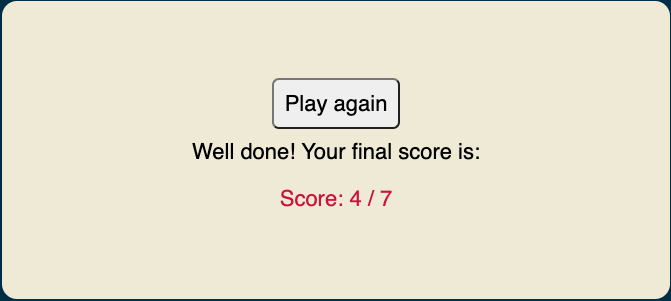
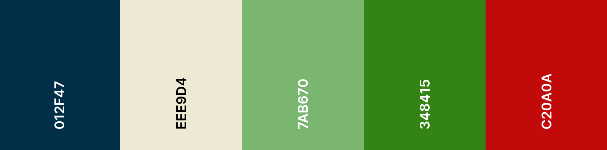
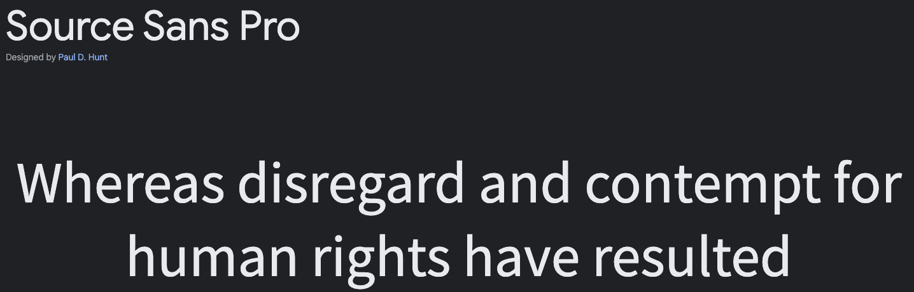
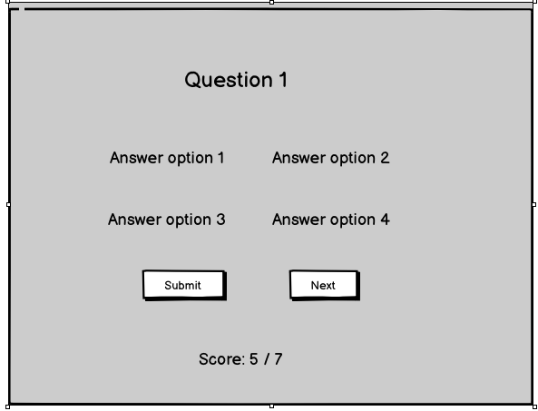
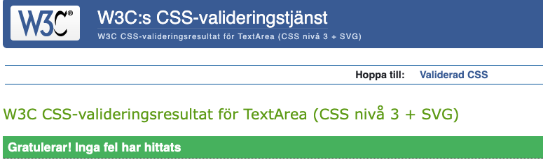
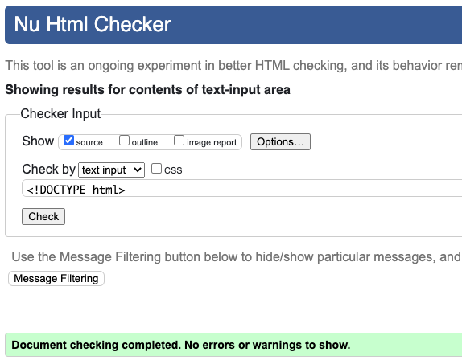
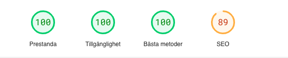
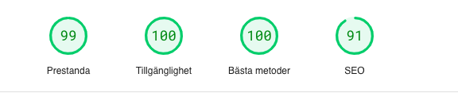

# History and Geography Quiz #

## 1. Purpose of the project ##
This is a standalone quiz with multiple choice questions for anyone interested in history and geography trivia. The quiz can be used for educational as well as recreational purposes, and spans a wide variety of subjects in order to trigger the curiosity of participants. To introduce a competitive element, the quiz also has a score counter and displays the final score at the end. The purpose of this project is to use HTML, CSS and JavaScript to create a website with interactive elements, in this case a quiz game. The website is responsive on mobile, computer and tablet size screens.

## 2. User stories ##
- As a user, I want to see the quiz start page and title to know what the topic of the quiz is.
- As a user, I want to start the quiz.
- As a user, I want to see the quiz question and the answer options.
- As a user, I would like to select and re-select my answer option before submitting it.
- As a user, I want to see if my submitted answer choice was correct or not before continuing with the next question.
- As a user, I want to see my current score.
- As a user, I want to see my final score and have the choice to restart the quiz.

## 3. Features ##

__Header__
-	The header contains the quiz title, and is present throghout the quiz.

__Start Page__
-	This is the first thing a user sees when clicking on the website link. The design is minimalistic to reduce distractions, and there is a short instruction in the quiz area on how to start the quiz.

__Quiz Interface:__

-	Once the start button has been clicked, the user sees the first question, the four answer options, the score counter and a short instruction on how to answer the question. The instruction disappears after the first question.
- All buttons in the quiz turn light green when hovered over, to increase UX.
- The Submit button appears after the user has clicked an answer option. The clicked option stays light green to mark the chosen option.
- The user can re-select the answer option as many times as they wish, before clicking the Submit button. This allows the user to ponder the answer, which is more educational.

- Once the Submit button has been clicked, the user is no longer able to change the answer, as the buttons are disabled. The correct answer option is shown in green. If the user's answer choice was incorrect, it will be shown in red.
- There is also a message below the questions alerting the user when an answer is correct or incorrect, and instructing the user to click Next.
- The score counter below increments with 1 when the submitted answer is correct.
- Clicking the Submit button also displays the Next button, giving the user the opportunity to re-read the question and their answers before moving on to the next question. This is also for educational purposes.

- The image below shows what the quiz interface looks like when a user answers a question correctly.

__Final Result__

- When all questions have been answered, an encouraging message is displayed along with the user's final score. A Play again button appears to restart the quiz, this returns the user to the start page.

## 4. Future features ##

- An endless amount of features could be added to the quiz: a wider variety of quiz topics, a larger library of questions and answers, and different question types such as open questions, picture ad audio questions and questions with multiple correct answers.
- The website could also include quizzes of varying difficulty levels to challenge users of varying level.

## 5. Color scheme and typography ##
- The color scheme for the website was first created manually, and then adjusted with the help of [Coolors](https://coolors.co/). The colors have a high amount of contrast to increase legibility and visibility and minimize distractions. The green and red were used specifically as they are commonly associated with correct and incorrect answers.

- [Google Fonts](https://fonts.google.com/) was used for the main font used in the whole website: Source San Pro. Sans-serif was used as a backup font.

## 6. Wireframes ##
Balsamiq was used to visualize the html structure and get an idea of which functions the website would have, before coding commenced. Below is a rough mockup of the main quiz interface:

## 7. Technology ##
- The wireframing software tool [Balsamiq](https://balsamiq.com/) was used to create a wireframe for the project.
- [GitPod](https://gitpod.io/) was used to write, edit and commit the code, while [GitHub](https://github.com/) was used for deployment, storage and version control.
- [Am I Responsive](https://ui.dev/amiresponsive) was used to create screenshot of website on different screen sizes.
- The font used on the website was imported from [Google Fonts](https://fonts.google.com/).
- [FavIcon](https://favicon.io/) was used for the website´s icon.
- W3C validator was used for finding errors in the code throughout the project and improving quality.
- Chrome Dev tools was used for increasing responsivity, testing CSS rules and exploring ways of managing bugs in the code.
- PageSpeed Insights of web.dev (part of Chrome Dev tools) was used to measure site performance, accessibility, SEO and best practice.

## 8. Testing ##

### 8.1 Code validation ###
- HTML
  - No errors were returned when passing the HTML code through the official W3C validator

- CSS
  - No errors were found when passing the CSS code through the official Jigsaw Validator.

- JavaScript
  - No errors were found when passing script.js through the official [JSHint Validator](https://jshint.com/).
  - According to JSHint, currentQuestion is an unused variable. However, the variable is defined in script.js and used in several places of the file.
  - Both questions.js and script.js files were validated together, as validating them separately made JSHint show the variable QUESTIONS in the questions.js file as unused, which is not the case.s

### 8.2 Performance testing ###
[PageSpeed Insights](https://pagespeed.web.dev), part of Chrome Dev tools was used to measure performance, availability, best practice and SEO (respectively).
- Lighthouse test for desktop

- Lighthouse test for mobile

### 8.3 Test cases ###

#### Start button ####

Expected outcome: displays quiz interface, with question, answer options and instructions

Testing performed: click Start button.

Result: displays quiz interface, with question, answer options and instructions

Test passed.

#### Submit answer option ####

Expected outcome: user should be able to select and reselect answer options before clicking Submit

Testing performed: click Submit button.

Result: user´s answer option is recorded

Test passed.

### 8.4 Fixed bugs ###

In the latest version of the website, the Submit button appears after the user has clicked an answer option. The Submit button used to be visible all the time, however this led to a bug where the user was not required to choose an option before clicking on Submit, whereupon the correct answer would be revealed. Hiding the Submit button until the user clicked on an answer option was an easy fix to this issue.

### 8.5 Supported screens and browsers ###
The website was tested for all default screen sizes in Chrome Dev Tools Simulator. As the website was responsive to small and large screens alike, no media queries were created.
- The website was tested on Chrome, Brave and Safari browsers and works well on all.

## 9. Deployment ##

### 9.1 Via GitPod ###
The GitHub repository was created using the Code Institute GitPod template:
https://github.com/Code-Institute-Org/gitpod-full-template
- Click the link to get to the template. Click “Use this template”.
- Enter repository name, QuizProject, make the repository is public and click “Create repository from template”.
- Click the green GitPod button, wait a moment for the workspace to open. All work was commited in GitPod.

- The repository can be accessed through following link: https://github.com/robinozer/QuizProject.git 

### 9.2 Via GitHub Pages ###
Github Pages was used to deploy the website. The following steps were used:
- In GitHub, navigate to the repository and find the Settings tab at the top menu.
- Click on Pages in the left hand Menu.
- In “Build and deployment”, go to Branch, select main, and save.
- Wait a moment and refresh the page to find a box with the live URL. The website is now deployed.

## 10. Credits ##

### Content ###

- Questions 1-5 in the quiz were borrowed from: https://www.mentimeter.com/blog/audience-energizers/55-free-trivia-and-fun-quiz-question-templates. Questions 6-7 were written by me, see array in questions.js for the whole list.

### Media ###
- The Q icon in the title was taken from [FavIcon](https://favicon.io/)