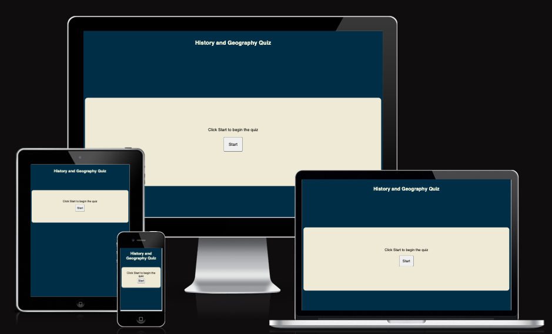
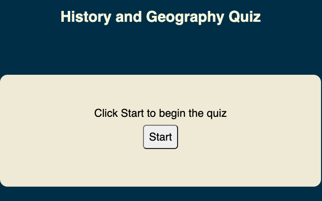
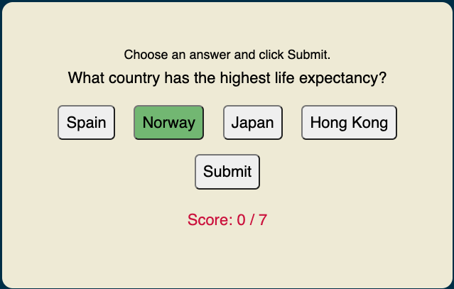
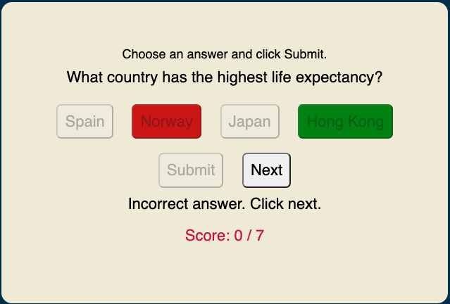
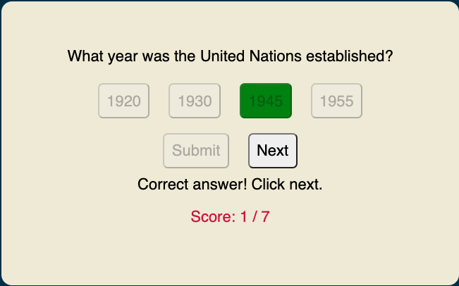

# History and Geography Quiz #

## 1. Purpose of the project ##
This is a standalone quiz with multiple choice questions for anyone interested in history and geography trivia. The quiz can be used for educational as well as recreational purposes, and spans a wide variety of subjects in order to trigger the curiosity of participants. To introduce a competitive element, the quiz also has a score counter and displays the final score at the end. The purpose of this project is to use HTML, CSS and JavaScript to create a website with interactive elements, in this case a quiz game. The website is responsive on mobile, computer and tablet size screens.

## 2. User stories ##
- As a user, I want to see the quiz start page and title to know what the topic of the quiz is.
- As a user, I want to start the quiz.
- As a user, I want to see the quiz question and the answer options.
- As a user, I would like to select and re-select my answer option before submitting it.
- As a user, I want to see if my submitted answer choice was correct or not before continuing with the next question.
- As a user, I want to see my current score.
- As a user, I want to see my final score and have the choice to restart the quiz.

## 3. Features ##

__Header__
-	The header contains the quiz title, and is present throghout the quiz.

 __Start Page__

 -	This is the first thing a user sees when clicking on the website link. The design is minimalistic to reduce distractions, and there is a short instruction in the quiz area on how to start the quiz.

__Quiz Interface:__

 -	Once the start button has been clicked, the user sees the first question, the four answer options, the score counter and a short instruction on how to answer the question. The instruction disappears after the first question.
 - All buttons in the quiz turn light green when hovered over, to increase UX.
 - The Submit button appears after the user has clicked an answer option. The clicked option stays light green to mark the chosen option.
 - The user can re-select the answer option as many times as they wish, before clicking the Submit button. This allows the user to ponder the answer, which is more educational.

 - Once the Submit button has been clicked, the user is no longer able to change the answer, as the buttons are disabled. The correct answer option is shown in green. If the user's answer choice was incorrect, it will be shown in red.
 - There is also a message below the questions alerting the user when an answer is correct or incorrect, and instructing the user to click Next.
 - The score counter below increments with 1 when the submitted answer is correct.
 - Clicking the Submit button also displays the Next button, giving the user the opportunity to re-read the question and their answers before moving on to the next question. This is also for educational purposes.

- The image below shows what the quiz interface looks like when a user answers a question correctly.

